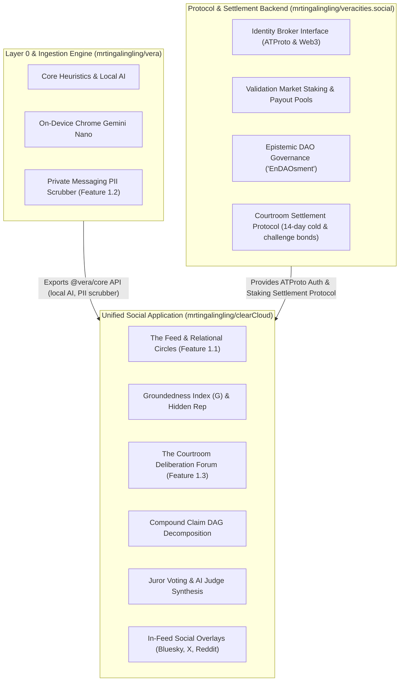

# ☁️ clearCloud · Unified Epistemic Social Application

> Feature 1.1 (The Feed & Relational Circles) + Feature 1.3 (The Courtroom Deliberation Forum) for the Vera ecosystem.

---

## 🏗️ Architecture Blueprint

`clearCloud` is the flagship user-facing social application, consuming protocol settlement services from [`mrtingalingling/veracities.social`](https://github.com/mrtingalingling/veracities.social) and local on-device AI from [`mrtingalingling/vera`](https://github.com/mrtingalingling/vera):



Detailed specification available in [**`docs/architecture.md`**](./docs/architecture.md).

---

## 🌟 Application Features

1. **Feature 1.1: The Epistemic Feed & Relational Circles (`src/feed/`)**:
   - 3-Tier Circles: Tier 1 (Close Friends), Tier 2 (Friends/Acquaintances), Tier 3 (Network-Wide).
   - Groundedness Index formula: $G = \frac{\text{Facts}}{\text{Facts} + \text{Speculation} + 3 \times \text{Falsehood}}$.
   - Asymmetric Hidden Reputation engine ("Trust is hard to build, fast to lose").
   - Tier 1 Personal Rage-Bait Scrubber.
2. **Feature 1.3: The Courtroom Deliberation Forum (`src/courtroom/`)**:
   - Falsifiability Gatekeeper strictly screening empirical claims from subjective/metaphysical statements.
   - Case Manager with Compound Claim DAG hierarchical decomposition.
   - 14-day cold case refund mechanism (**94% refunded**, **6% protocol fee**).
   - Challenge Bond retrial appeals (overturned verdicts award bond + 50% bounty).
   - Anonymous stake-weighted juror deliberation and AI judicial synthesis.
3. **In-Feed Social Overlays (`src/social/`)**:
   - Live badge and card generator for Bluesky, X/Twitter, Reddit, and YouTube.

---

## 🚀 Quickstart & Testing

```bash
npm install
npm test
```
