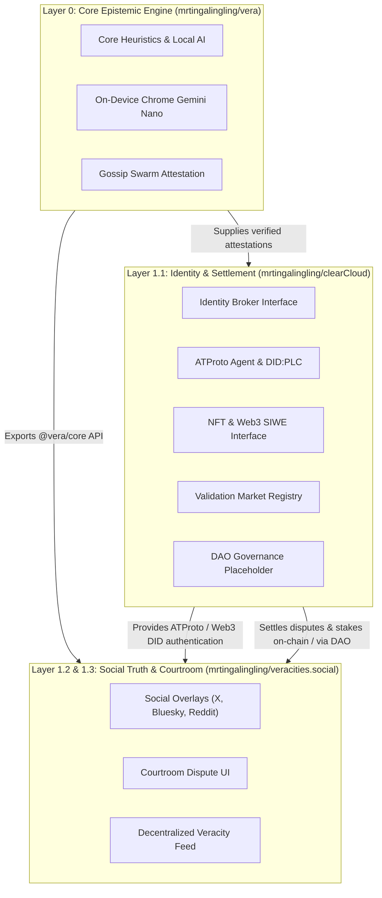

# ☁️ clearCloud · Layer 1.1 Decentralized Identity & Validation Market

> Decentralized Identity (ATProto & Web3 NFT), Validation Market registry, and Epistemic DAO governance ("EnDAOsment") for the Vera truth settlement ecosystem.

---

## 🏗️ Architecture Blueprint

clearCloud sits at **Layer 1.1** of the Vera multi-repository architecture, connecting Layer 0 (`mrtingalingling/vera`) on-device claim evaluation with Layer 1.2/1.3 (`mrtingalingling/veracities.social`) social courtroom deliberation:



Detailed specification available in [**`docs/architecture.md`**](./docs/architecture.md).

---

## 🔑 Key Features

### 1. ATProto & Web3 Identity Broker (`src/identity/`)
- **ATProto First**: Connects with Bluesky / AT Protocol Personal Data Servers (`@atproto/api`), authenticates handles (`alice.bsky.social`), resolves `did:plc` directories, and generates authenticated JWT sessions.
- **Future Web3 / NFT Option**: Extensible EIP-4361 Sign-In With Ethereum (SIWE) and ERC-721 token gating to link on-chain wallets (`did:pkh:eip155:...`).

### 2. Validation Market Registry (`src/market/validationMarket.js`)
- Prediction and staking pools for disputed claims.
- Evaluates payouts based on Vera's 4 epistemic outcomes: `VERIFIED`, `MISINFORMED`, `DISPUTED`, and `NEED_CONTEXT`.
- Dynamic odds calculation and automated oracle consensus settlement.

### 3. Epistemic DAO Governance ("EnDAOsment") (`src/governance/daoRegistry.js`)
- Proposal lifecycle management for protocol rules, oracle whitelisting, and slashing appeals.
- Weighted voting with configurable consensus thresholds.

---

## 🚀 Quickstart & Testing

```bash
# Install dependencies
npm install

# Run Vitest test suite (19 unit & integration tests)
npm test
```

---

## 📦 Consuming as a Dependency

In downstream applications (e.g. `veracities.social`):

```javascript
import { createAuthProvider, ValidationMarket, DaoRegistry } from 'clearcloud';

// 1. Authenticate with ATProto
const auth = createAuthProvider('atproto');
const session = await auth.authenticate({ identifier: 'user.bsky.social', password: 'app-password' });
console.log('Logged in DID:', session.did);

// 2. Query Validation Market
const market = new ValidationMarket();
const odds = market.calculateMarketOdds('mkt_1');
```
