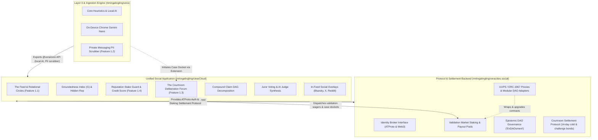

# ☁️ clearCloud · Unified Epistemic Social Application

> Feature 1.1 (The Feed & Relational Circles) + Feature 1.3 (The Courtroom Deliberation Forum) for the Vera ecosystem.

---

## 🏗️ Architecture Blueprint

`clearCloud` is the flagship user-facing social application, consuming protocol settlement services from [`mrtingalingling/veracities.social`](https://github.com/mrtingalingling/veracities.social) and local on-device AI from [`mrtingalingling/vera`](https://github.com/mrtingalingling/vera):



Detailed specification available in [**`docs/architecture.md`**](./docs/architecture.md).

---

## 🌟 Application Features

1. **Feature 1.1: The Epistemic Feed & Relational Circles (`src/feed/`)**:
   - 3-Tier Circles: Tier 1 (Close Friends), Tier 2 (Friends/Acquaintances), Tier 3 (Network-Wide).
   - Groundedness Index formula: $G = \frac{\text{Facts}}{\text{Facts} + \text{Speculation} + 3 \times \text{Falsehood}}$.
   - Asymmetric Hidden Reputation engine ("Trust is hard to build, fast to lose").
   - Tier 1 Personal Rage-Bait Scrubber.
2. **Feature 1.3: The Courtroom Deliberation Forum (`src/courtroom/`)**:
   - Falsifiability Gatekeeper strictly screening empirical claims from subjective/metaphysical statements via fast heuristics and Gemini Nano prompts.
   - Case Manager with Compound Claim DAG hierarchical decomposition.
   - 14-day cold case refund mechanism (**94% refunded**, **6% protocol fee**).
   - Challenge Bond retrial appeals (overturned verdicts award bond + 50% bounty).
   - Algorithmic Civic Sortition Summons (7–9 randomized citizens per docket) gated by Proof of Humanity ($\ge 20$) or Staked Civic Bonds ($\ge 10$ USDC).
   - Blind Trial Engine with deep semantic paraphrasing ($P(x, t)$), entity anonymization (`[Entity_A]`), emotional invective stripping, and synthetic decoy docket interleaving.
   - Substantive Evidence Submission Form in `CourtroomView.svelte` with live CID validation (`ipfs://`, `ar://`, `doi.org/`), AI relevance filtering ($\ge 0.70$), and escalating anti-griefing deposits ($50 \times 2^{n-1}$).
3. **In-Feed Social Overlays (`src/social/`)**:
   - Live badge and card generator for Bluesky, X/Twitter, Reddit, and YouTube.
4. **Epistemic Credit Score & Economic Governance (`src/config/`, `src/courtroom/`, `src/feed/`)**:
   - Epistemic Credit Score Interaction Weighting: Dynamically discounts likes and juror votes from low-reputation or astroturfing accounts (`CREDIT_SCORE_WEIGHTING_ENABLED: false`, feature-flagged).
   - Stake-to-Repost Guard: Requires low-rep users to escrow a stake before amplifying claims (`STAKE_TO_REPOST_ENABLED: false`, feature-flagged).
   - Influencer Reach Staking: High-reach accounts ($\ge 10,000$ followers) with sub-threshold reputation must deposit audience-scaled broadcast bonds.
   - Exponential Disinformation Penalties: Unbounded cost curves ($2^{\Delta/5} \times 2^{\text{strikes}}$) with no ceiling, making sustained disinformation financially ruinous.
   - Multi-Origin Case Initiation & Wager Surcharges: Docket initiation from `SOCIAL_MEDIA` and `EXTENSION_APP` with risk-adjusted wagering.

---

## 🏛️ DAO Governance Integration: EnDAOsment Smart Contract Framework

`clearCloud` citizens who build proven reputation through high Groundedness ($G$), quality citations, and accurate juror sortition deliberations directly map into the **EnDAOsment Epistemic DAO governance framework** powered by [`veracities.social/contracts/EpistemicCrsManager.sol`](https://github.com/mrtingalingling/veracities.social):

1. **Reputation to Credit Budgets**: Citizen tiers unlock quadratic credit budgets:
   - *Tier 1 (Novice)*: 100 Credits
   - *Tier 2 (Contributor)*: 500 Credits
   - *Tier 3 (Arbiter)*: 1,500 Credits
   - *Tier 4 (Sage Elder)*: 3,000 Credits
2. **Two-Stage Deliberation**: Sages vet proposals in Stage 1 (`ApprovalGovernor`), while citizens deploy credit budgets quadratically ($V = \lfloor\sqrt{C}\rfloor$) in Stage 2 (`QuadraticGovernor`).
3. **Safe Timelocks & Upgrade Decoupling**: Succeeded proposals transition through a 24–48h `TimelockControllerUpgradeable` inspection delay, with all reputation checkpoints preserved in persistent ERC-1967 proxy storage.

---

## 🚀 Quickstart & Testing

```bash
npm install
npm test # Runs 68/68 passing Vitest tests across 9 suites
npm run dev # Starts local Svelte 5 dev server on port 5173
```

Detailed architectural specifications, caveats, and deployment runbooks are documented in [**`docs/architecture.md`**](./docs/architecture.md) and canonical [**`vera/docs/ARCHITECTURE_CAVEATS_AND_ROADMAP.md`**](../vera/docs/ARCHITECTURE_CAVEATS_AND_ROADMAP.md).
