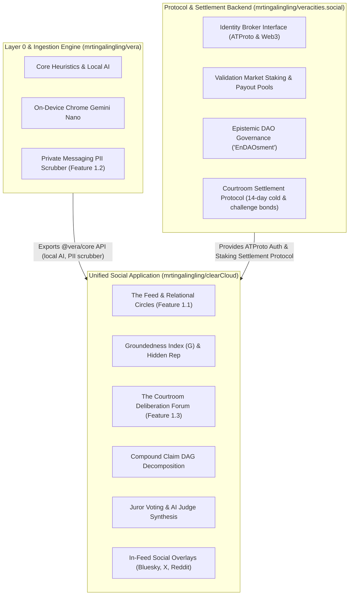

# clearCloud Architecture Blueprint (Unified Social Application)

## 1. Overview in the Vera Ecosystem

`clearCloud` is the **Unified Social Application** of the Vera decentralized truth network. It consolidates:
- **Feature 1.1**: The Epistemic Feed, 3-Tier Relational Circles, Groundedness Index ($G$) ranking, and Asymmetric Hidden Reputation dynamics.
- **Feature 1.3**: The Courtroom Deliberation Forum, Falsifiability Gatekeeper, Compound Claim DAG decomposition, Juror deliberation, and Challenge Bond retrials.

---

## 2. Core Application Modules

### 2.1 The Feed Subsystem (`src/feed/`)
- **Relational Circles (`feedManager.js`)**:
  - Tier 1 (Close Friends): Intimate circle with personal rage-bait filtering.
  - Tier 2 (Friends/Acquaintances): Balanced heuristic feed.
  - Tier 3 (Network-Wide): Algorithmic ranking driven 60% by Groundedness Index and 40% by Author Hidden Reputation.
- **Groundedness Index Formula**:
  $$G = \frac{\text{Facts}}{\text{Facts} + \text{Speculation} + (3 \times \text{Falsehood})}$$
- **Asymmetric Hidden Reputation Engine**:
  - Slow accrual: $+1.5$ per verified claim, $+2.0$ for jury consensus.
  - Swift deduction: $-18.0$ for debunked claims, $-12.0$ for rage-bait, $-25.0$ for courtroom slashing.

### 2.2 The Courtroom Subsystem (`src/courtroom/`)
- **Falsifiability Gatekeeper (`falsifiabilityGatekeeper.js`)**: Screens claims before docket admission, blocking unprovable subjective/aesthetic statements.
- **Case Manager (`caseManager.js`)**:
  - Compound Claim DAG hierarchical decomposition (`decomposeClaim`).
  - 14-day stale cold case refund execution (**94% refunded**, **6% maintenance fee** retained).
  - Challenge Bond retrial appeals (overturned verdicts award bond + 50% bounty; reaffirmed forfeit bond).
- **Jury & AI Judge Engine (`juryEngine.js`)**:
  - Stake-weighted anonymous juror voting on evidence citations.
  - AI Judge judicial summary synthesizing consensus.

### 2.3 Social Overlays (`src/social/`)
- **Overlay Cards (`overlayService.js`)**: Renders epistemic badges and cards across Bluesky, X, Reddit, and YouTube with direct links to Courtroom case dockets.
