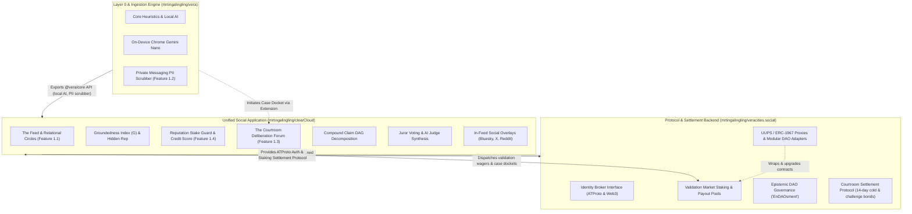

# clearCloud Architecture Blueprint (Unified Social Application)

## 1. Overview in the Vera Ecosystem

`clearCloud` is the **Unified Social Application** of the Vera decentralized truth network. It consolidates:
- **Feature 1.1**: The Epistemic Feed, 3-Tier Relational Circles, Groundedness Index ($G$) ranking, and Asymmetric Hidden Reputation dynamics.
- **Feature 1.3**: The Courtroom Deliberation Forum, Falsifiability Gatekeeper, Compound Claim DAG decomposition, Juror deliberation, and Challenge Bond retrials.

---

## 2. Core Application Modules

### 2.1 The Feed Subsystem (`src/feed/`)
- **Relational Circles (`feedManager.js`)**:
  - Tier 1 (Close Friends): Intimate circle with personal rage-bait filtering.
  - Tier 2 (Friends/Acquaintances): Balanced heuristic feed.
  - Tier 3 (Network-Wide): Algorithmic ranking driven 60% by Groundedness Index and 40% by Author Hidden Reputation.
- **Groundedness Index Formula**:
  $$G = \frac{\text{Facts}}{\text{Facts} + \text{Speculation} + (3 \times \text{Falsehood})}$$
- **Asymmetric Hidden Reputation Engine**:
  - Slow accrual: $+1.5$ per verified claim, $+2.0$ for jury consensus.
  - Swift deduction: $-18.0$ for debunked claims, $-12.0$ for rage-bait, $-25.0$ for courtroom slashing.

### 2.2 The Courtroom Subsystem (`src/courtroom/`)
- **Falsifiability Gatekeeper (`falsifiabilityGatekeeper.js`)**: Screens claims before docket admission, combining fast heuristic filters with Chrome Gemini Nano SLM evaluation.
- **Case Manager (`caseManager.js`)**:
  - Compound Claim DAG hierarchical decomposition (`decomposeClaim`).
  - 14-day stale cold case refund execution (**94% refunded**, **6% maintenance fee** retained).
  - Challenge Bond retrial appeals (overturned verdicts award bond + 50% bounty; reaffirmed forfeit bond).
  - Substantive evidence validation enforcing decentralized CID/DOI references, relevance $\ge 0.70$, and escalating reset deposits ($50 \times 2^{n-1}$).
- **Blind Trial Engine (`blindTrialEngine.js`)**:
  - Entity masking (`[Entity_A]`) and emotional rhetoric scrubbing.
  - Deep semantic paraphrasing ($P(x, t)$) to suppress stylometric leakage.
  - Interleaving synthetic decoy dockets to prevent attention brigading.
- **Civic Sortition Engine (`sortitionEngine.js`)**:
  - Randomly summons 7–9 citizen jurors from the registered registry.
  - Sybil protection: Enforces Proof of Humanity score $\ge 20$ or Staked Civic Bond $\ge 10$ USDC.
  - Automatic recusal of bettors holding active stakes on the docket.
- **Jury & AI Judge Engine (`juryEngine.js`)**:
  - Disinterested citizen juror voting on citations.
  - AI Judge judicial summary synthesizing consensus and issuing signed attestations.

### 2.3 Social Overlays (`src/social/`)
- **Overlay Cards (`overlayService.js`)**: Renders epistemic badges and cards across Bluesky, X, Reddit, and YouTube with direct links to Courtroom case dockets.

### 2.4 Epistemic Credit Score & Economic Governance (`src/config/`, `src/courtroom/`, `src/feed/`)
- **Epistemic Credit Score Interaction Weighting (`reputationStakeGuard.calculateInteractionWeight`)**:
  - `CREDIT_SCORE_WEIGHTING_ENABLED: false` (feature-flagged, disabled by default).
  - When enabled: Citizen reputation acts like a credit score affecting all platform interactions.
  - Likes/reactions from low-reputation or suspected astroturfing accounts are quadratically down-weighted ($\max(0.01, (\text{rep} / 50.0)^2)$), while high-reputation accounts earn up to $2.0\times$ weight boost.
  - Juror voting weights scale with credit score ($\max(0.05, \text{rep} / 50.0)$).
- **Stake-to-Repost Guard (`reputationStakeGuard.evaluateStakeToRepost`)**:
  - `STAKE_TO_REPOST_ENABLED: false` (feature-flagged, disabled by default).
  - When enabled: Amplifying/reposting content requires low-reputation users ($\text{rep} < 40.0$) to deposit an escrow stake (`REQUIRED_REPOST_STAKE_USDC`: 5.0 USDC).
- **Influencer Reach Staking (`reputationStakeGuard.evaluateStakeToPost`)**:
  - `INFLUENCER_STAKE_ENABLED: false` (feature-flagged, disabled by default).
  - Accounts with $\ge 10,000$ followers carry elevated systemic risk. If their reputation falls below $60.0$, they must deposit an audience-scaled stake bond ($20 \text{ USDC} \times (1 + \log_{10}(\text{followers}/10000))$).
- **Exponential Disinformation Penalties (Unbounded Cost Curve)**:
  - `EXPONENTIAL_DISINFO_PENALTY_ENABLED: false` (feature-flagged, disabled by default).
  - Stakes escalate exponentially with reputation deficits ($2^{(\text{threshold} - \text{rep}) / 5}$) and disinformation strikes ($2^{\text{strikes}}$).
  - There is **no cost ceiling**, making repeated disinformation campaigns financially impossible to sustain.
- **Low-Reputation Wager Surcharges & Case Initiation (`caseManager.js`, `reputationStakeGuard.js`)**:
  - `CASE_WAGER_REQUIRED: false` (feature-flagged, disabled by default).
  - Supports docket initiation from both `SOCIAL_MEDIA` and `EXTENSION_APP`.
  - Low-reputation or penalized bettors incur cost surcharges in validation markets.

### 2.5 EnDAOsment Governance Integration
Citizen track records in `clearCloud` directly connect to Layer 3 Epistemic Governance maintained in `veracities.social/contracts/EpistemicCrsManager.sol`:
1. **Reputation to Checkpointed CRS**: Verified engagement and juror accuracy map to Vera's 4 Epistemic Tiers, which `EpistemicCrsManager.sol` checkpoints by block number.
2. **Quadratic Deliberation**: High-tier Sages vet proposals in Stage 1 (`ApprovalGovernor.sol`), and citizens allocate quadratic credit budgets ($V = \lfloor\sqrt{C}\rfloor$) in Stage 2 (`QuadraticGovernor.sol`).
3. **UUPS Proxy Decoupling**: Upgrades to the upstream framework never erase `clearCloud` citizen voting checkpoints or proposal records stored in persistent ERC-1967 proxy storage.

---

## 3. Cross-Repository Architectural Invariants

For cross-repository architecture specifications, multi-module connection flows, remaining production caveats, and maintenance guides, consult the authoritative canonical document:
[**`vera/docs/ARCHITECTURE_CAVEATS_AND_ROADMAP.md`**](../../vera/docs/ARCHITECTURE_CAVEATS_AND_ROADMAP.md).
