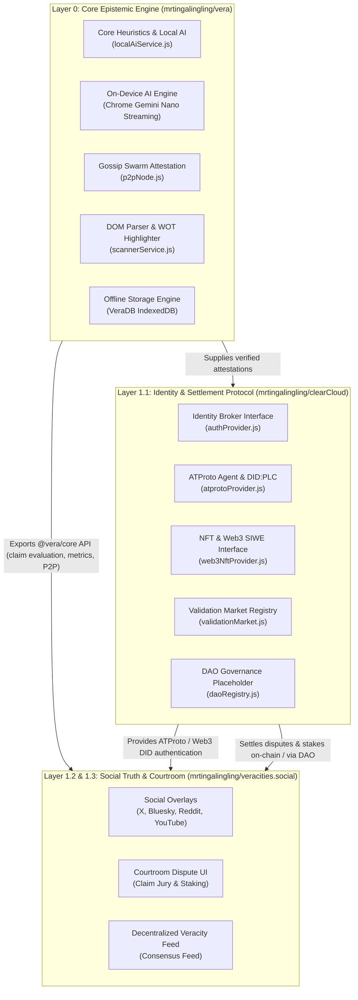

# clearCloud Architecture Blueprint (Layer 1.1)

## 1. Role in the Vera Ecosystem

`clearCloud` is the **Layer 1.1 Decentralized Identity, Validation Market & EnDAOsment Protocol** of the Vera truth settlement ecosystem.

---

## 2. Subsystems

### 2.1 Identity Subsystem (`src/identity/`)
- **ATProto Authentication Provider (`atprotoProvider.js`)**:
  - Connects to Bluesky / AT Protocol Personal Data Servers (`https://bsky.social` or custom PDS).
  - Resolves handles (`alice.bsky.social`) to decentralized identifiers (`did:plc:...`).
  - Issues and verifies session JWT tokens.
- **Web3 & NFT Identity Provider (`web3NftProvider.js`)**:
  - Implements EIP-4361 Sign-In With Ethereum (SIWE).
  - Resolves EVM addresses to W3C `did:pkh:eip155:<chainId>:<address>`.
  - Provides extensible token-gating interface for ERC-721/1155 NFT ownership credentials.

### 2.2 Validation Market Subsystem (`src/market/validationMarket.js`)
- Supports stake-weighted claim wagering across Vera's 4 epistemic outcomes:
  `VERIFIED`, `MISINFORMED`, `DISPUTED`, `NEED_CONTEXT`.
- Tracks prediction pools, computes implied probabilities & odds multipliers.
- Automated resolution upon oracle/jury verdict settlement with payout distribution.

### 2.3 Epistemic DAO Governance Subsystem ("EnDAOsment") (`src/governance/daoRegistry.js`)
- Protocol proposal lifecycle (`ACTIVE` -> `PASSED`/`FAILED` -> `EXECUTED`).
- Weighted voting based on epistemic reputation and staked tokens.
- Quorum & consensus threshold enforcement (e.g. 66% supermajority).
